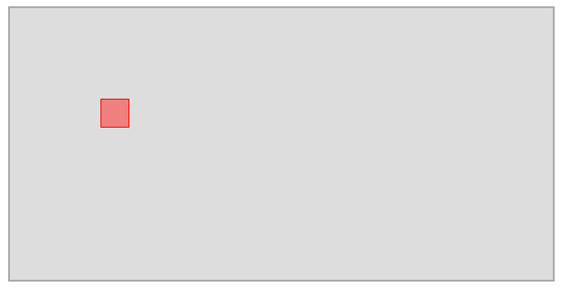

# 2022-05-28 Intermediate Problem: A Barebones Game

**React:** Optional (your game will likely perform better if you don't use React)

We're going to make a very simple game! Or at least, the foundation for a game. The player will be represented by a red box. You'll be able to move the red box around a 2D map using the arrow keys. The map will have a wall at each edge — it should not be possible to move through a wall.

## Problem Description

### Part 1

- Create a 2D map which is simply a gray `
` with a border. The map should be 600 pixels wide and 300 pixels tall.
- Place a red square (the player) within the map. The player should be 30 pixels wide and start with its top left corner at the point (100, 100).

## Part 2

Make it so holding down an arrow key moves the player in that direction. For simplicity, we will not support moving the player diagonally by holding two arrow keys at once.

Example: If the `ArrowLeft` key is down and the user presses `ArrowUp`, the game should behave as if only `ArrowUp` is down.

_Note:_ Using `setInterval` is not recommended since it seems to crash CodeSandbox.

## Part 3

Prevent the player from moving outside of the map.

## Reference Solution

**Do not view the solution before the end of the meetup!** https://codesandbox.io/s/intermediate-game-movement-kh6fev?file=/src/index.ts
